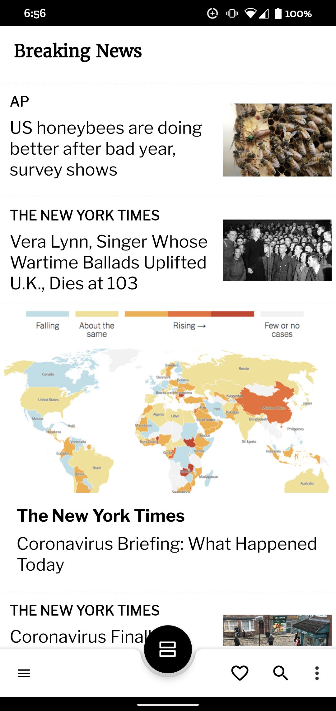
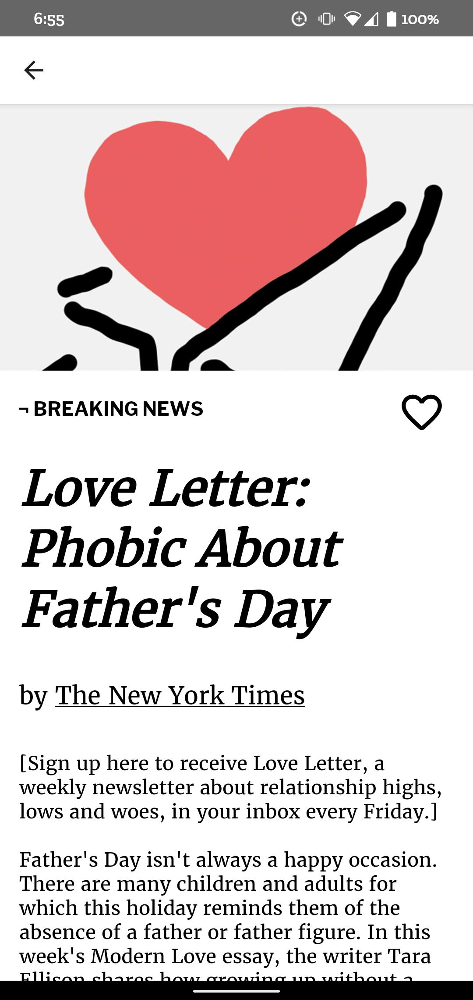
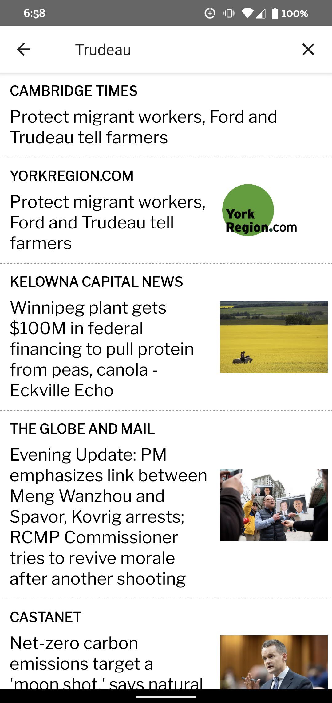
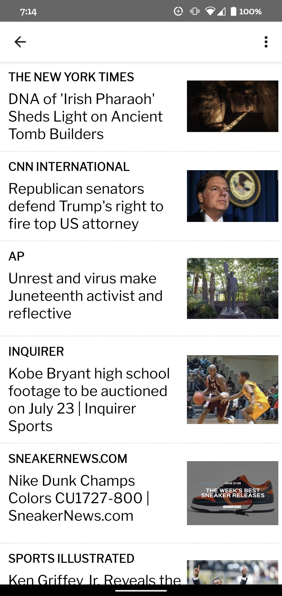
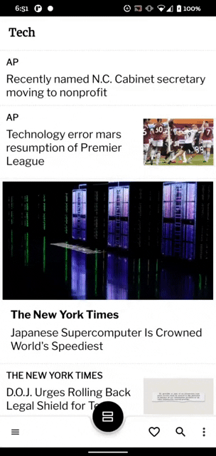

[](https://github.com/gerin98/NewsCast/blob/master/LICENSE) [](https://github.com/gerin98/NewsCast/releases)


## A modern News App for Android written in Kotlin
NewsCast lets you find and and read articles you care about natively within the app. Browse from a wide assortment of categories and save interesting articles for later!

<p align="center">
  
  
  
  
</p>

## Table of Contents
**[1. Features](#features-bulb)**<br>
**[2. Tech Stack](#tech-stack-hammer_and_wrench)**<br>
**[3. Api](#api-newspaper)**<br>
**[4. Troubleshooting](#troubleshooting-warning)**<br>
**[5. See it in Action](#see-it-in-action)**<br>
**[6. Credits](#credits)**<br>
**[7. Author](#author)**<br>
**[8. License](#license)**<br>

## Features :bulb:
#### Beatiful News Viewer
Read your news articles directly within the app. No redirects. No switching back and forth. Just you and your news.

#### Browse News from a variety of curated categories
Simply choose a news topic from the sidebar to browse the latest articles

#### Save important news for later
We don't always have time to read through the whole article. Double tap to add an article to your favourites and come back to it later.

#### Search at your fingertips
Can't find what you're looking for? Search for keywords to find articles for practically any topic

## Tech Stack :hammer_and_wrench:

- Language
  - [Kotlin](https://kotlinlang.org/) - First class and official programming language for Android development.
- Architecture
  - [MVVM & Repository pattern](https://developer.android.com/jetpack/docs/guide#overview) - separate ui logic from business logic
  - [LiveData](https://developer.android.com/topic/libraries/architecture/livedata) - an observable lifecycle-aware data holder class
  - [Coroutines](https://kotlinlang.org/docs/reference/coroutines/coroutines-guide.html) - for asynchronous programming and more
  - [ViewBinding](https://developer.android.com/topic/libraries/view-binding) - easily write code that interacts with views
- Dependency Injection
  - [Koin](https://insert-koin.io/) - A pragmatic lightweight dependency injection framework
- Network
  - [Retrofit](https://square.github.io/retrofit/) - A type-safe HTTP client for Android and Java
  - [OkHttp](https://square.github.io/okhttp/) - an HTTP client that’s efficient by default
  - [Moshi](https://github.com/square/moshi) - a modern JSON library for Android and Java
- Database
  - [Room](https://developer.android.com/training/data-storage/room) - robust database access while harnessing the full power of SQLite
- UI
  - [Databinding](https://developer.android.com/topic/libraries/data-binding) - bind UI components in your layouts to data sources in your app
  - [Material Design](https://material.io/design) - a visual language that synthesizes the classic principles of good design with the innovation of technology and science
  - [Icons](https://material.io/resources/icons/?style=baseline) - delightful, beautifully crafted symbols for common actions and items
- Image loading
  - [Glide](https://github.com/bumptech/glide) - An image loading and caching library for Android focused on smooth scrolling
- Logging
  - [Timber](https://github.com/JakeWharton/timber) - a logger with a small, extensible API which provides utility on top of Android's normal Log class.
- Testing
  - [Robolectric](https://github.com/robolectric/robolectric) - a framework that brings fast and reliable unit tests to Android
  - [Stetho](http://facebook.github.io/stetho/) - a sophisticated debug bridge for Android applications

## Api :newspaper:
NewsCast is powered by [Event Registry's](http://eventregistry.org/) api to search and provide relevant news articles.

## Troubleshooting :warning:
If you are unable to load news articles, the token limit for my api key may have been reached. Please make an account with [Event Registry](http://eventregistry.org/) and use your own api key.

## See it in Action

<p align="center">
  
  
</p>

## Credits
Icons made by <a href="https://www.flaticon.com/authors/freepik" title="Freepik">Freepik</a> from <a href="https://www.flaticon.com/" title="Flaticon"> www.flaticon.com</a>

Inspired by [Fortnightly](https://material.io/design/material-studies/fortnightly.html)

## Author

   <br /> 

**Gerin Amalaraj**  

[](https://www.linkedin.com/in/gerin-amalaraj/)<br>

## License
```
MIT License

Copyright (c) 2020 Gerin Amalaraj

Permission is hereby granted, free of charge, to any person obtaining a copy
of this software and associated documentation files (the "Software"), to deal
in the Software without restriction, including without limitation the rights
to use, copy, modify, merge, publish, distribute, sublicense, and/or sell
copies of the Software, and to permit persons to whom the Software is
furnished to do so, subject to the following conditions:

The above copyright notice and this permission notice shall be included in all
copies or substantial portions of the Software.

THE SOFTWARE IS PROVIDED "AS IS", WITHOUT WARRANTY OF ANY KIND, EXPRESS OR
IMPLIED, INCLUDING BUT NOT LIMITED TO THE WARRANTIES OF MERCHANTABILITY,
FITNESS FOR A PARTICULAR PURPOSE AND NONINFRINGEMENT. IN NO EVENT SHALL THE
AUTHORS OR COPYRIGHT HOLDERS BE LIABLE FOR ANY CLAIM, DAMAGES OR OTHER
LIABILITY, WHETHER IN AN ACTION OF CONTRACT, TORT OR OTHERWISE, ARISING FROM,
OUT OF OR IN CONNECTION WITH THE SOFTWARE OR THE USE OR OTHER DEALINGS IN THE
SOFTWARE.
```
